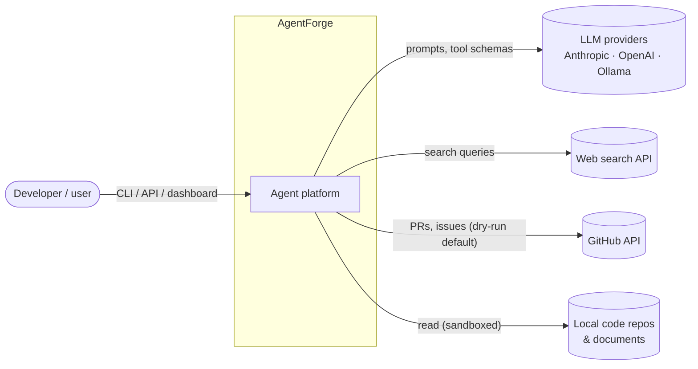
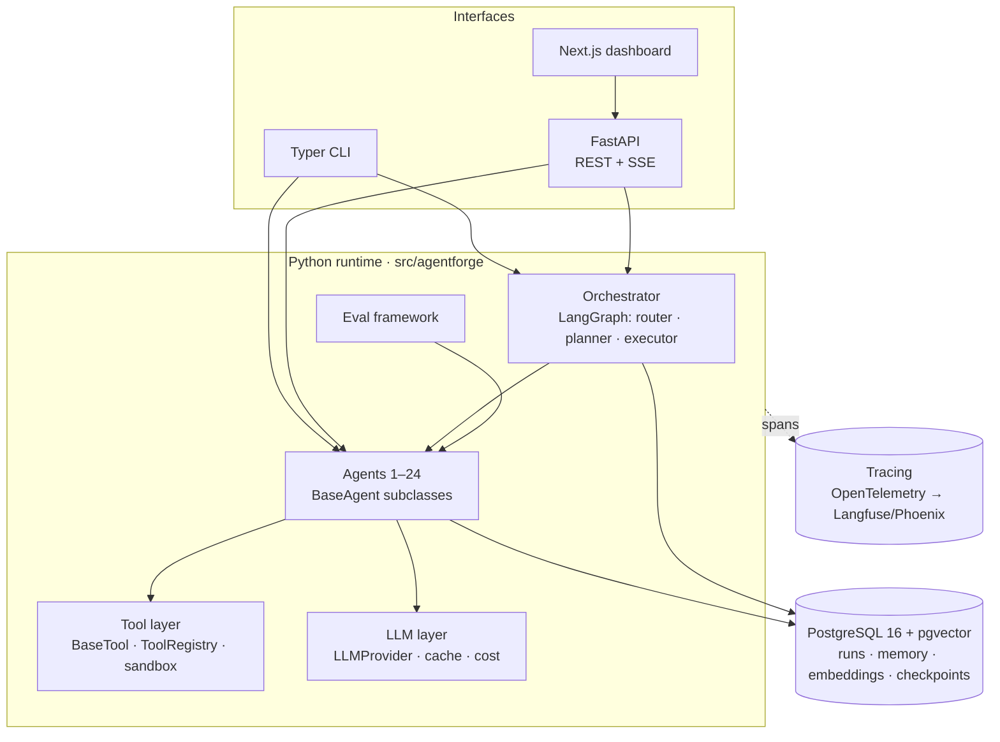
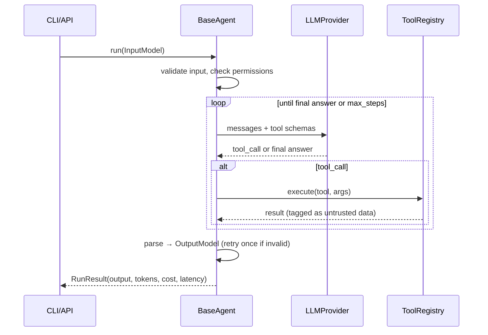

# AgentForge — Architecture

> Draft v0.1 · Week 1, Day 1 · Living document: update it whenever an ADR changes something here.

## 1. Goals and non-goals

**Goals**

1. Provide one shared runtime so each of the 25 agents is *thin*: a prompt, a typed input/output schema, a tool list and an eval set.
2. Make agents composable: every agent returns a validated Pydantic model that another agent can consume.
3. Use any LLM provider (Anthropic, OpenAI, local Ollama) behind one interface, with a fake provider for offline tests.
4. Keep it safe by default: sandboxed tools, permission levels, and dry-run for anything that writes to external systems.
5. Make quality measurable: every agent ships with golden eval cases from the start.
6. Show the value in one demo: requirement → orchestrator → 8 agents → deliverable.

**Non-goals (for v1.0)**

- Multi-tenant SaaS, billing or user management beyond API keys.
- Training or fine-tuning models.
- Autonomous agents that write to production systems without human approval.
- Supporting every LLM framework. LangGraph is used for the orchestrator only.

## 2. System context (C4 level 1)



## 3. Containers (C4 level 2)



## 4. Layers and dependency rule

Each layer may import only from the layers **below** it.

| # | Layer | Package | Responsibility |
|---|---|---|---|
| 7 | Interfaces | `cli/`, `api/`, `web/` | User entry points; no business logic |
| 6 | Orchestration | `orchestrator/` | Routing, planning, parallel execution, human-in-the-loop (HITL) |
| 5 | Agents | `agents/<name>/` | Prompt + schemas + tools + evals per agent |
| 4 | Agent runtime | `core/` | `BaseAgent`, tool-calling loop, registry, permissions |
| 3 | Tools | `tools/` | `BaseTool`, registry, built-in sandboxed tools |
| 2 | LLM | `llm/` | Provider adapters, retries, caching, token/cost accounting |
| 1 | Platform | `config`, `logging`, `db/`, `observability/` | Cross-cutting infrastructure |

## 5. Core concepts

| Concept | What it is |
|---|---|
| **Agent** | A class with `name`, `description`, `InputModel`, `OutputModel`, `tools`, `prompt`. `run(input) -> RunResult[Output]`. |
| **Agent card** | Machine-readable description of an agent's capabilities and schemas; the orchestrator's router reads it. |
| **Tool** | A function with a Pydantic argument schema (exported as JSON Schema to the LLM) and a permission level: `read`, `write`, `network`, `exec`. |
| **LLMProvider** | `complete(messages, tools, response_schema) -> LLMResponse`. Implementations: Anthropic, OpenAI, Ollama, Fake. |
| **Run** | One execution: input, output, tool calls, tokens, cost, latency, status, trace ID. Persisted to Postgres (from week 5). |
| **Eval case** | An input plus expectations (exact fields, checks, or a judge rubric). Stored in `agents/<name>/evals/`. |

## 6. How a single agent run works



## 7. Flagship demo scenario

Every agent contract is designed so this chain works without re-parsing free text.

```
$ agentforge orchestrate "Build a leave-management module for a 200-person company"

Plan:  BA → PM → Planner → (API ∥ Database) → Security → QA → Docs
HITL:  approve plan? [y/n]
```

| Step | Agent | Consumes | Produces |
|---|---|---|---|
| 1 | Business Analyst (16) | Requirement text | `UserStories` (stories + Gherkin acceptance criteria) |
| 2 | Product Manager (17) | `UserStories` | `PRD` (scope, RICE ranking, MVP cut) |
| 3 | Project Planner (18) | `PRD` | `ProjectPlan` (WBS, sprints, dependencies) |
| 4a | API Design (6) | `PRD` + `UserStories` | `OpenAPISpec` (validated) |
| 4b | Database Schema (7) | `PRD` + `UserStories` | `DatabaseSchema` (DDL executed in a test DB) |
| 5 | Security Audit (8) | `OpenAPISpec` + `DatabaseSchema` | `SecurityReport` |
| 6 | QA (24) | `UserStories` + `OpenAPISpec` | `TestPlan` (cases + Playwright skeletons) |
| 7 | Documentation (4) | All of the above | `DocsBundle` (README + architecture notes) |

Steps 4a and 4b run in parallel.

## 8. Quality attributes

| Attribute | How we get it |
|---|---|
| **Testability** | FakeLLM plus record/replay fixtures; CI never calls a real LLM. |
| **Reliability** | Structured outputs, schema validation, retry-on-invalid, max-step guard, timeouts. |
| **Safety** | Tool permission levels; tool output treated as untrusted data; sandboxed file/exec; `--apply` required for external writes. |
| **Cost control** | Cheap default models, response cache, per-run cost logged. |
| **Observability** | structlog JSON logs with `run_id`; OpenTelemetry spans per agent/tool/LLM call. |
| **Extensibility** | A new agent is a folder: `prompt.md`, `schema.py`, `agent.py`, `evals/`. |

## 9. Open questions

- [ ] Default model per provider for development (cost vs. quality)?
- [ ] Code sandbox: subprocess with resource limits, or a Docker container per run?
- [ ] Tracing backend: Langfuse or Arize Phoenix?
- [ ] Web search provider for the Research agent: Tavily, Brave or SerpAPI?

Resolve each one with an ADR in `docs/adr/`.
